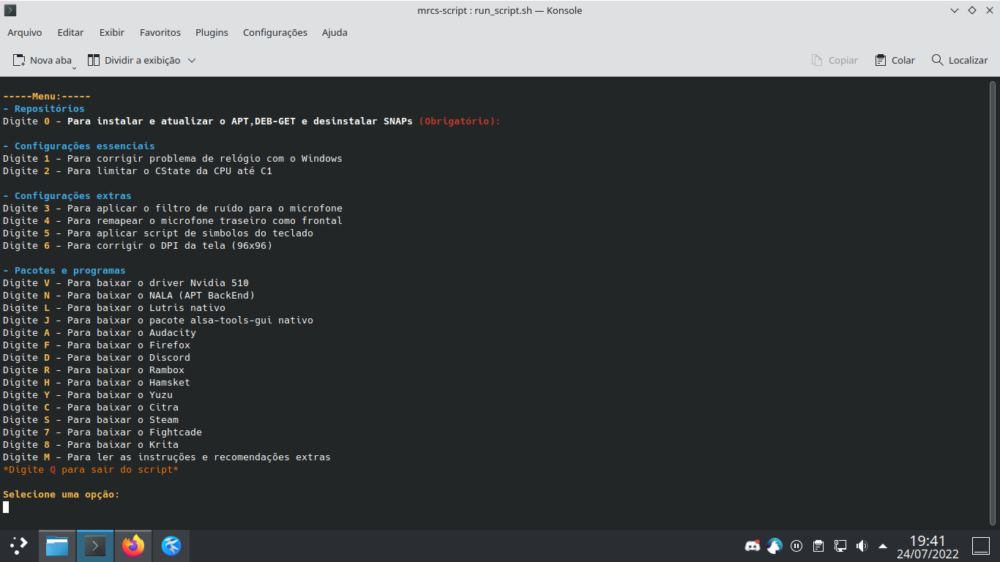

# script-mrcs

Esse script foi criado para automatizar a customização do sistema antes e depois de formatar o PC.

Funções do script:
- Aplicar minhas configurações de sistema após uma instalação.
- Instalar os meus programas principais.
- Fazer e restaurar um backup das configurações dos programas.

Use esse script como base para criar o seu.
